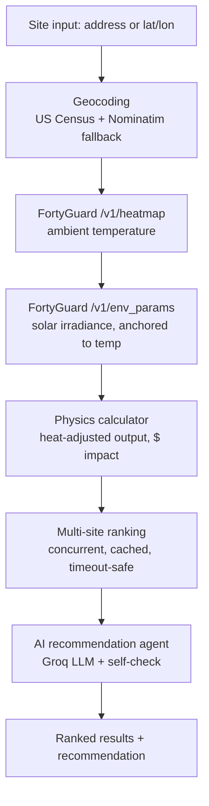

# SolarShield ☀️🛡️

**Smart Solar Site Intelligence** — built on FortyGuard's Temperature API®

SolarShield helps homeowners, installers, and businesses answer a question
solar calculators usually ignore: *how much does heat actually cost you?*
Panels lose real, quantifiable output as they get hotter — SolarShield pulls
live hyperlocal temperature and solar irradiance data for any U.S. site,
computes the actual usable power output (not just theoretical sunlight),
ranks multiple candidate sites, and generates an AI-backed recommendation
for where to install.

Built for the FortyGuard Global AI Hackathon'26 — Track 02 (Future Buildings
& Energy) with Track 06 (Agentic AI) elements.

---

## What it does

1. Takes one or more candidate sites (a U.S. address or lat/lon coordinates)
2. Pulls live ambient temperature via FortyGuard's `/v1/heatmap` endpoint
3. Uses that temperature as the anchor for `/v1/env_params`, which returns
   real solar irradiance (GHI/DNI/DHI) for the exact same point
4. Computes actual panel output using the industry-standard temperature
   coefficient of power (~-0.40%/°C above the 25°C STC reference) applied
   to a realistic panel-surface-temperature estimate, combined with the
   real irradiance reading
5. Ranks all sites by actual usable kW output (not just raw sunlight)
6. An LLM agent (Groq) generates a plain-English recommendation, with a
   self-check pass that verifies the recommendation is internally
   consistent with the raw numbers before it's returned (an
   evaluator-optimizer pattern — genuine multi-step agentic reasoning,
   not a single text-generation call)

## Architecture



## Tech stack

- **Backend:** FastAPI, Python, the official `fortyguard` client package
- **AI:** Groq (`openai/gpt-oss-120b`) for the recommendation agent
- **Geocoding:** US Census Bureau geocoder (primary) + Nominatim/OpenStreetMap (fallback)
- **Frontend:** React (Vite)
- **Deployment:** Railway (backend), [frontend host]

## Team

- **Backend / API integration:** Bushra Batool
- **Frontend / UI:** Farah

## How to run it

### Backend

```bash
git clone <this-repo-url>
cd <repo-folder>
python -m venv venv
venv\Scripts\activate        # Windows
# source venv/bin/activate   # macOS/Linux

pip install -r requirements.txt
```

Create a `.env` file in the project root:

```
FORTYGUARD_API_KEY=your_key_here
FORTYGUARD_BASE_URL=https://api.fortyguard.com
GROQ_API_KEY=your_groq_key_here
```

Run it:

```bash
uvicorn app.main:app --reload
```

Test at `http://127.0.0.1:8000/docs` — try `POST /rank-sites` with:
```json
{ "sites": [], "include_defaults": true }
```

### Frontend

```bash
cd frontend
npm install
npm run dev
```

Update `BACKEND_URL` in `src/App.jsx` to point at your running backend
(local or deployed) before building for production.

## One real FortyGuard API request + response

**Request** — `POST https://api.fortyguard.com/v1/heatmap`
```json
{
  "polygon_aoi": {
    "type": "FeatureCollection",
    "features": [{
      "type": "Feature",
      "properties": {},
      "geometry": {
        "type": "Polygon",
        "coordinates": [[
          [-112.077, 33.4454], [-112.071, 33.4454],
          [-112.071, 33.4514], [-112.077, 33.4514],
          [-112.077, 33.4454]
        ]]
      }
    }]
  },
  "date_time": { "start_date": "2026-08-24", "start_time": "14:00", "filter_type": 1 },
  "granularity": 60
}
```

**Response** (after polling `GET /v1/status/{activity_id}` until `"Completed"`):
```json
{
  "error": false,
  "status_code": 200,
  "message": "Completed",
  "data": {
    "status": "Completed",
    "result": {
      "map_data": { "type": "FeatureCollection", "features": [ /* per-tile temps */ ] },
      "stats_data": {
        "Temperature_stats": {
          "Minimum": 39.1, "Maximum": 44.6, "Mean": 41.9, "Standard_deviation": 1.3
        }
      }
    }
  }
}
```

That `41.9°C` mean was then passed as the `temperature=` anchor into
`POST /v1/env_params` for the same point, which returned real solar
irradiance for Phoenix, AZ: **GHI 862.85 W/m², DNI 861.43 W/m², DHI 118.13
W/m²** — the exact numbers behind our live-tested result of **107.4°F,
4.37 kW actual output, 15.56% heat loss, $281/year lost** for a 6kW system
at that site.

## Known limitations / what doesn't work yet

- **Single point-in-time snapshot, not a historical average.** Rankings
  reflect current/recent conditions (data is pulled from ~5 days back to
  avoid FortyGuard's real-time ingestion lag), not a multi-day or seasonal
  average. A genuinely "best" long-term site would need `filter_type=4`
  averaged across weeks — descoped for time.
- **No rooftop image / CV analysis.** We considered a computer-vision
  module to estimate shading/dust from an uploaded rooftop photo, but
  deliberately cut it — without real training data, it risked producing
  inaccurate-looking output that would hurt credibility more than help it.
- **U.S. coverage only** — a hard limit of the underlying FortyGuard API,
  not our code.
- **Slow-site handling:** each site involves two sequential FortyGuard
  calls (heatmap + env_params), each with its own submit-then-poll cycle.
  We cap each at a 90s timeout and skip sites that don't respond in time
  (with the reason surfaced in the API's `skipped_sites` field) rather
  than hanging the whole request — but a request with only one, very slow,
  uncached site can still return an error if that timeout is hit. Keeping
  "Include demo sites" on avoids an empty result screen in that case.
  A 30-minute in-memory cache means repeated/demo locations respond
  near-instantly after the first fetch.
- **No user-drawn map/polygon input** — sites are entered as an address or
  lat/lon text field, not a map click. Kept intentionally simple for the
  timeframe.
